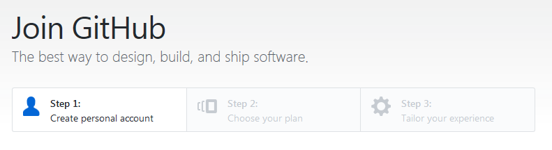
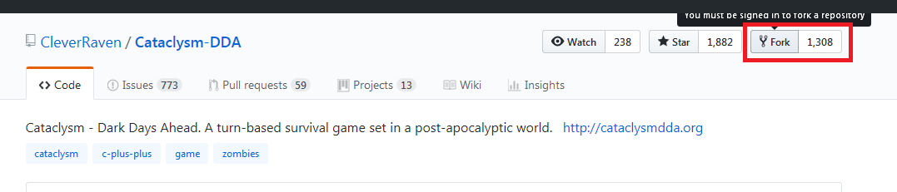
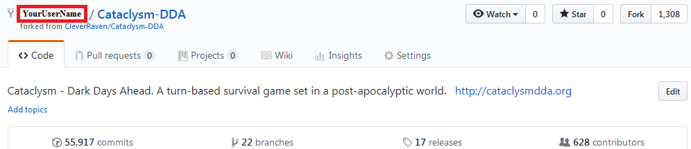
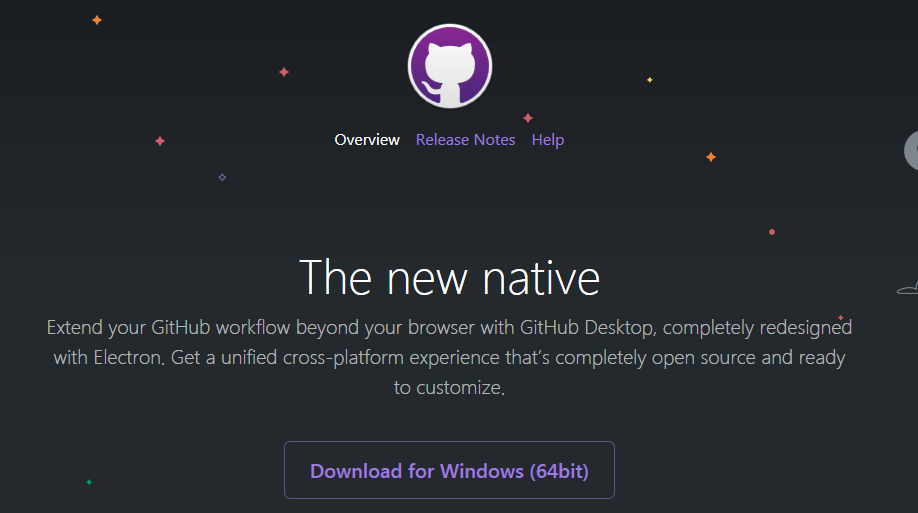
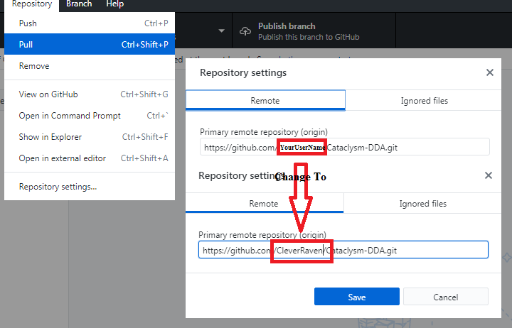
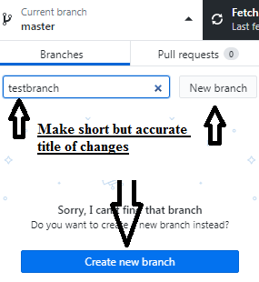
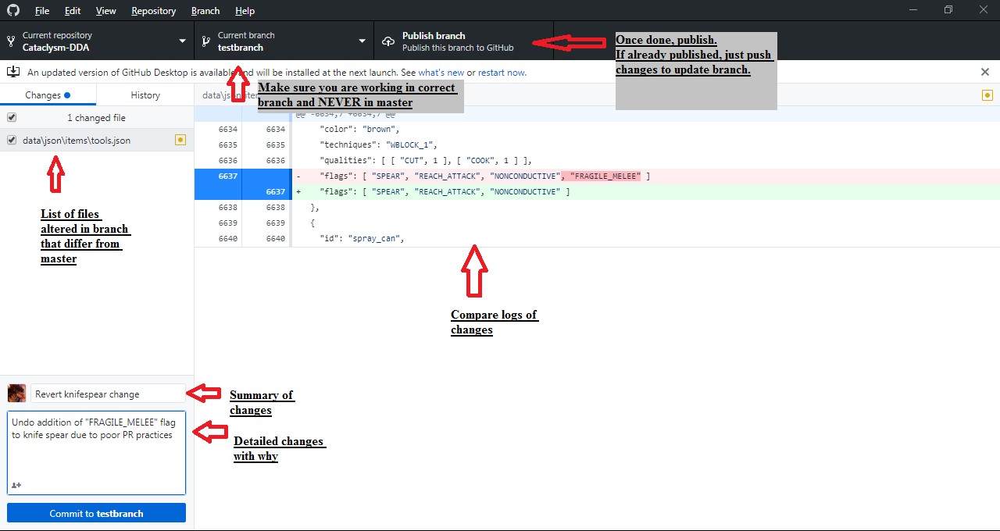

# CDDA GitHub Start
Author: https://github.com/DracoGriffin

1.  Make a GitHub account
 
1.  Fork CleverRaven's master branch of CDDA
 
1.  Verify your fork exists under your profile
 
1.  Download and configure/sync GitHub Desktop with your new account
 
1.  Before making new branches, ensure your master branch is up to date with CleverRaven's by temporarily changing the repository from ***YourUserName*** to ***CleverRaven*** and **Pull** changes (do NOT Push, luckily you'll just get an error since you should not have privileges)
 
1.  Change ***CleverRaven*** back to ***YourUserName*** after pulling successfully and now **Push** instead to make sure your master branch is up to date (helps avoid conflicts if you try to PR something later)
 
1.  Make a new branch locally of your master fork on GitHub Desktop (sometimes makes weird commit errors) or on Github website
 
1.  Make changes locally to files for the branch and after reviewing and detailing items, publish branch / update branch if already published. You can now go to https://github.com/CleverRaven/Cataclysm-DDA and there will be a new line asking if you'd like to make a Pull Request of your changes to be implemented in the main CDDA game
 

## What's next

You can start looking through [this list of "Good First Issues"](https://github.com/CleverRaven/Cataclysm-DDA/issues?q=is%3Aissue+is%3Aopen+label%3A%22Good+First+Issue%22) as well as other [issues](https://github.com/CleverRaven/Cataclysm-DDA/issues), then secondly looking at [Cataclysm: Dark Days Ahead Projects](https://github.com/CleverRaven/Cataclysm-DDA/projects) to see if there's anything you can do, and lastly the [List of easy jobs](https://github.com/CleverRaven/Cataclysm-DDA/wiki/Want-to-help-with-development%3F-List-of-easy-jobs).

There are some standards like [Code Style Guide](https://github.com/CleverRaven/Cataclysm-DDA/blob/master/doc/CODE_STYLE.md) and [Manual of style](https://github.com/CleverRaven/Cataclysm-DDA/blob/master/doc/MANUAL_OF_STYLE.md).

Also I'd just suggest the whole [doc](https://github.com/CleverRaven/Cataclysm-DDA/tree/master/doc) folder.
